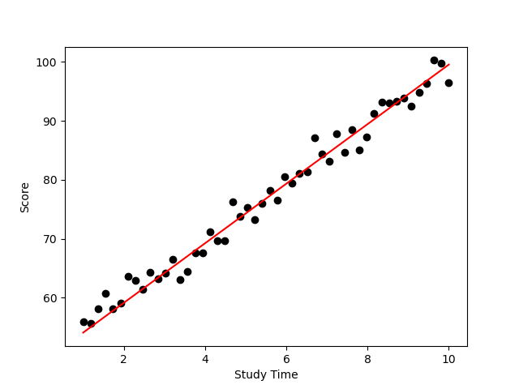

# Linear Regression from Scratch

This project implements **linear regression from scratch in Python** using **gradient descent**, without relying on machine learning libraries. The goal is to predict a student’s **score** based on their **study time**.

## 📌 Features

- Computes the best-fitting line by learning:
  - the **slope (m)**
  - the **intercept (b)**
- Uses **Mean Squared Error (MSE)** as the loss function
- Visualizes:
  - the original data points
  - the learned regression line

## 📊 Result

The plot below shows:
- **Black points**: real data (study time vs score)  
- **Red line**: the regression line learned using gradient descent  

  

## 📝 Notes

- No data cleaning is performed. The CSV file must contain **only numeric values** and **no missing data**.
- The **learning rate** and **number of epochs** may need to be adjusted depending on your dataset.
- The model is trained using **pure Python** (no NumPy, no scikit-learn).
